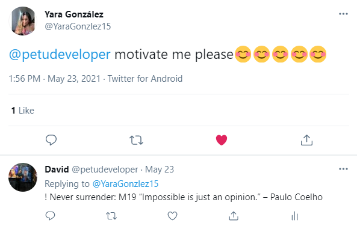
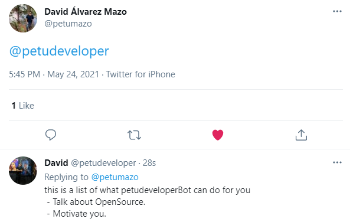

# Twitter KeepDevelopingBot 

A witty bot for twitter designed to motivate, inspire and help newbies software developers. This bot is designed with Ruby and will fav all your replies with a random phrase (depending on the topic). There are three main topics that the bot can reply about: open-source, motivation, and famous quotes about programming.

The KeepDevelopingBoy will also post a tweet with random facts (within 29 in total) about programming every 12 hours.

The bot checks for and replies/fav every 30 seconds.

## Built With

- Ruby
  - chatterbot (GEM)
  - dotenv (GEM)
- Twitter API

## Getting Started

To get a local copy up and run the program do these steps on the console:
- To clone the project to your machine, run `git clone https://github.com/petumazo/KeepDevelopingBot.git`
- To navigate into the project folder/directory, run `cd KeepDevelopingBot/bin`.
- To run the executable creator, run `gem install ocra` and then `ocra Keep_developing_bot.rb`
- To go back one folder run `cd ..`
- To install the required dependencies, run `bundle install`.
- **For it to run you'll have to get your _Token, Secret Toke, Consumer Key_ and _Consumer_Secret_ to connect with Twitter API and paste that information in the field with those names.
- To run the bot, run `bin/Keep_developing_bot.rb` in the console.

- To run RSpec:
  - run 'gem install rspec' on your console from the root directory
  - run 'rspec' to check for tests 
### Prerequisites
- Have ruby compiler installed on your system. You can get it from [here](https://www.ruby-lang.org/es/documentation/installation/)

## Example of the bot Working

### Replies to empty tweet

### Replies when `motivate` tweet

## Authors

👤 **David Alvarez**

- GitHub: [@petumazo](https://github.com/petumazo)
- Twitter: [@petudeveloper](https://twitter.com/petudeveloper)
- LinkedIn: [LinkedIn](https://www.linkedin.com/in/david-alvarez-mazzo-777712143/)

## 🤝 Contributing

Contributions, issues, and feature requests are welcome!

## Show your support

Give a ⭐️ if you like this project!

## Acknowledgments

- Hat tip to anyone whose code was used
- Inspiration
- etc

## 📝 License

This project is [MIT](./MIT.md) licensed.
